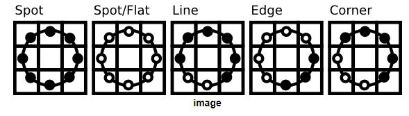
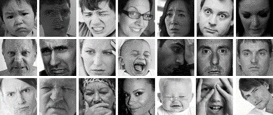
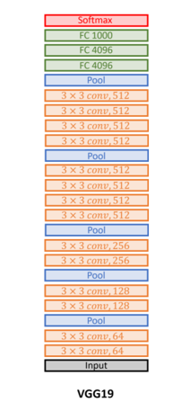
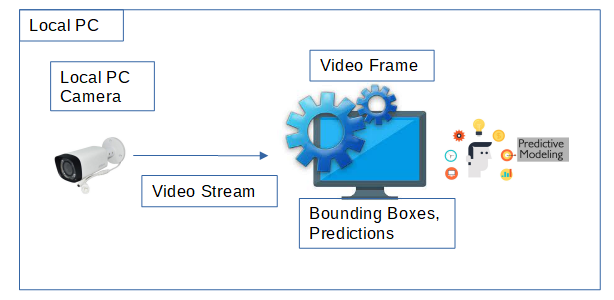
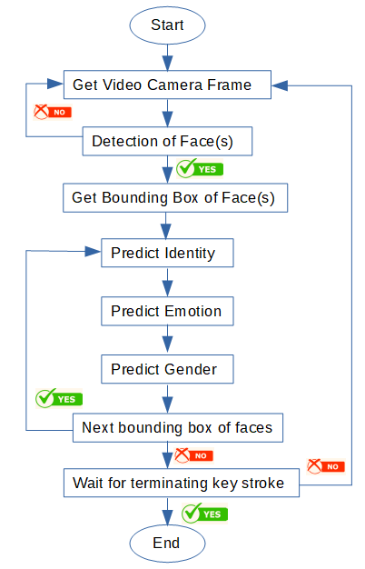
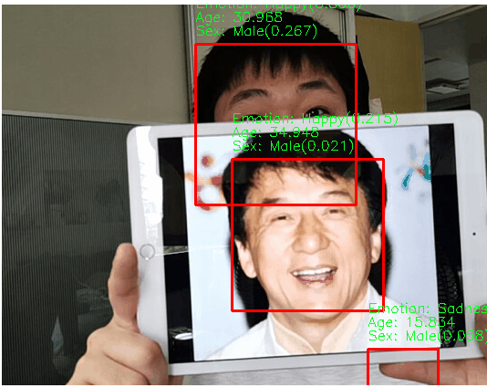

# Visual Judgement <a name="Title"></a>

## Table of Contents <a name="TOC"></a>
1. [Project Description](#Description)
2. [System Architecture](#System)
3. [Installation and Usage](#Installation)
4. [Contributer](#Contribute)
5. [License](#License)

## 1. Project Description <a name="Description"></a>

This project aims to determine the identity, gender, and emotion of a person. The application works by first detecting the face of the person in a video stream via **object detection** and then identifying the person, gender, and emotion through **object classification**.

### 1.0 Overview
In the object detection, faces are detected with the DNN architecture from opencv,
Res10 300x300 SSD and return the bounding coordinates. 

The bounding coordinates are passess to the classifier to determine the 
identity, gender, and emotion.

The respective classifiers are trained on the following architectures. 

### 1.1 Models
The below section covers the various models used in each of the components.

Object Detection
1.  Deep Neural Network model (HAAR cascade swop out in replacement with DNN)
> * support Caffe, Tensorflow, Pytorch Framework
> * Using the Caffe models for object detection; prototxt(model architecture),
caffemodel(weights for the actual layer)
> * Res10 300 x 300 Single Shot MultiBox Detector, faster than R-CNN
> * Extract feature maps and apply convolutional filters to detect object
> * Res10 instead of VGG as it tackle the effect of vanishing gradients

#### 1.1.1  Facical Recognition
> * Uses Local Binary Patterns Histograms (LBPH) algorithm. The face recognition 
algorithms extract the features from the image and represent them in a manner
for classification.
> * Compared with treating the data as a vector in a high-dimensional space
, the LBPH concentrate on extracting local features from the image.
> * Some disadvantages are illumination variation, scale, translation and 
rotation
> * Basic idea of LBPH is to summarize local structure by comparing pixel with
its neighbourhood. Take a pixel and set a threshold against its neighbours. If a pixel value is above the threshold for a certain neighbour, it is flagged. As shown below, if a pixel is >= 5, it is flagged as '1'.
>
>   
>
> * Using this idea, various patterns can be identified.
>
>   
> * LBPH image is divided into 'm' local regions and extracted into a histogram
> * A spatially enhanced feature vector is then obtained by concatenating the local histograms.

#### 1.1.2  Gender Prediction
*Dataset* 
> * Trained on a UTKFace dataset. 
> * Total samples: 24,070
> * 2 Categories: Male, Female
>
>   

*Data Augmentation*
> * To increase the diversity of the image dataset and improve the model's robustness, data augmentation was conducted
> * Width shift, and height shift were set to 0.1. 
> * Rotation range was set to 20. 
> * Horizontal flip was set to True while vertical flip was set to False.

*Model Architecture*
> * A robust, lightweight model, MobileNetv2 was used and finetuned with the images.
> * Achieved test accuracy of **87.34%**

#### 1.1.3  Emotion Prediction
*Dataset* 
> * Trained on a combination of **48x48** grayscale images from Facial Expression Recognition 2013 (FER2013), Extended Cohn-Kanade (CK+), and a facial expression dataset obtained from muxspace GitHub repository. 
> * Total samples: 50,494
> * 7 Categories: Anger, Disgust, Fear, Happy, Sad, Surprise, Neutral
>
>   

*Data Augmentation*
> * To increase the diversity of the image dataset and improve the model's robustness, data augmentation was conducted
> * Width shift, height shift, and zoom range were set to 0.2. 
> * Rotation range was set to 20.

*Model Architecture*
> * A voting ensemble with 3 VGG19 was trained
>
>   
>
> * Achieved test accuracy of **73.37%**

## 2. System Architecture <a name="System"></a>
### 2.1 Hardware Overview
For this project, a laptop or computer with a webcam is all you need.



### 2.2 Software Overview
Upon executing the script, the camera on the user's laptop will be triggered.
The live video stream is then passed to the system for face detection. 
The bounding boxes, along with the frames, are then sent for facial recognition, gender and emotion prediction.
The bounding boxes, along with the predictions are drawn on the screen.
Once done, the user can easily stop the script by pressing the set termination key stroke ('q').



During runtime, the video should look similar to below.



### 2.3 Folder Structure
```
Facial_Judgement                           # main project folder
├── src
│   ├── app.py                        # main application file
│   ├── app_flask.py                  # main flask web application
│   ├── modelling
│       ├── emo_recognition
│       │   ├── emo_recog.py          # emotion recognition model class (emo_recog)
│       ├── facial_recognition
│       │   ├── face_recog.py         # face recognition model class (facial_recognizer)
│       ├── gender_recognition
│           ├── gender_recog.py       # gender recognition model class (gender_recog)
├── model                             # weights for the respective model used
│   ├── emo_recognition
│   │   ├── emo_VGG19.hdf5
│   ├── face_detection
│   │   ├── deploy.prototxt
│   │   ├── res10_300x300_ssd_iter_140000.caffemodel
│   ├── face_recognition
│   │   ├── trained_weights.yml
│   ├── gender_recognition
│   │   ├── gender_mobileNet.hdf5
├── tests
│   ├── __init__.py
│   ├── test_emotion.py               # unit tests for emotion prediction model (emo_VGG19.hdf5)
│   ├── test_gender.py	              # unit tests for gender prediction model (gender_mobileNet.hdf5)
│   ├── test_face_detection.py        # unit tests for face detection class (test_face_detection.py)
├── images
    ├── 16_0_0_20170110232142982.jpg  # image used for test_gender.py
    ├── 1_1_0_20170109190742179.jpg   # image used for test_gender.py
    ├── AIAP-Banner.png               # image used for README.md
    ├── FER2013.png                   # image used for README.md
    ├── LBPH.jpg                      # image used for README.md
    ├── LBPH_patterns.jpg             # image used for README.md
    ├── UTKFace.png                   # image used for README.md
    ├── VGG19.png                     # image used for README.md
    ├── background.png                # image used for index.html in template folder
    ├── banner.png                    # image used for index.html in template folder
    ├── black.png                     # image used for index.html in template folder
    ├── overview_hardware.png         # image used for README.md
    ├── overview_software.png         # image used for README.md
    ├── sample_outcome.png            # image used for README.md
    ├── test1.jpg                     # image used for test_emotion.py
    ├── ...
    ├── test7.jpg                     # image used for test_emotion.py
```
You could give instructions in depth of how the code works and how everything is put together.

## 3. Installation <a name="Installation"></a>
### 3.1 Environment Setup
1. Create new virtual environment
```
conda create --name <envname> python=3.6.7
```
2. Install the following packages
```
conda install <packagename>
```
```
Optional packages, not required to install if already have base anaconda environment
  1. python=3.6.7
  2. pip=19.0.3
  3. numpy=1.17.2
Development packages, for running unit
  4. pytest==4.6.3
  5. Pillow=8.4.0
Deployment packages
  6. imutils==0.5.4
  7. opencv-contrib-python==4.5.4.60
  8. tensorflow==2.6.2
  9. flask=2.0.2
```

### 3.2 Usage 
#### 3.2.1 Running Unit Tests
Check that you are at the **root folder**, i.e. Facial_Judgement, before running the following command:
```
pytest ./tests
```
#### 3.2.2 Running the app
Check that you are at the **root folder**, i.e. Facial_Judgement, before running the following command:
```
pytest -m src.app
```

#### 3.2.3 Running the flask web app
**Server side**
<br>Check that you are at the **root folder**, i.e. assignment8, before running the following command:
```
pytest -m src.app_flask
```

**Client side**
<br>After flask server has started, access the html page via http://127.0.0.1:8000

**Changing the default IP address**
1. app_flask.py: change the IP at '_main_'
2. index.html: change the java script (start_stream) to change image src to new IP address 

#### 3.2.4 Running the executable .bat file
1. Open run.bat using a text editor (NotePad, NotePad+ etc.)
2. Replace the appropriate paths - path to conda, virtual environment name
3. Replace the function call (python -m src.app OR python -m src.app_flask), as necessary
4. Save the file
5. Run the file by double-clicking

#### 3.2.5 Notes
Further usage of this project can be for verification purposes, sentiment 
analysis of host etc.

## 4. Contributer <a name="Contribute"></a>

AIAP team 2 
* XinJie - Lead
* YuYang
* KahGhi
* Simon

## 5. License <a name="License"></a>

AI Singapore, AIAP 9 Mini Project, Team 2

## Resources

https://docs.opencv.org/3.4/da/d60/tutorial_face_main.html

https://caffe.berkeleyvision.org/

https://www.mdpi.com/1999-4907/12/10/1419/htm

